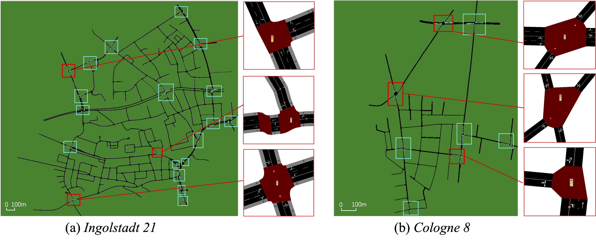

# Resources for "A General Scenario-Agnostic Reinforcement Learning for Traffic Signal Control"

This page give the code, data, scenarios, and demo results for our paper submission.

## Updated: Demo Results for Zoomed Single Intersection

The result for Arterial 4x4 Scenario:


> As shown above, the Arterial 4x4 has quite high traffic volume, especially in the selected intersection: both FTC and GESA-Single get quite long traffic queues in the West and South entering approaches, and FTC also has a long queue in the North approach. However, our GESA could promptly and dynamically release the traffic jam.


The result for Cologne 8 Scenario:


> As shown in the demo, the North entering approach has quite high traffic inflow, and all the benchmarks could not release the flow on time, resulting in a long queue. Our GESA could release the jam timely.


The result for Fenglin Scenario:


> As mentioned in the paper, Fenglin is a corridor with an East-West main road. As shown in the demo, high volume of traffic flow concentrated in the middle through-lane of the East entering approach, resulting in the traffic jam in the benchmark methods. MaxPressure and GESA have fewer jams than MPLight in that lane, and GESA has fewer accumulated vehicles on other lanes.


## Demo Results

The result for Grid 4x4 Scenario:


The result for Arterial 4x4 Scenario:


The result for Cologne Scenario:


The result for Fenglin Scenario:


## Scenarios introduction
There are seven scenarios in the dir: sumo_files/env/.

### Open source scenarios 
There are four open-source scenarios: Grid4x4, Arterials4x4, Cologne8, and Ingolstadt21. And the Grid 5×5 is designed by us, following the same setting of Grid 4×4. All of them are shown in Fig1 and Fig2.

The scenarios of Fig1.(a) Grid 4×4, Fig1.(b) Grid 5×5, with all the intersections signaled and each entering approach having three lanes with movements of left, through, and right, respectively; Fig1.(c) Arterial 4×4, with all the intersections signaled, E & W entering approaches having two lanes with movements of left and right-through, as N & W entering approaches having one lane with the movement of left-through-right. (The blue strips indicate the locations of 50-meter detectors.)

<center>Fig 1. </center>	

The scenarios of Fig2.(a) Ingolstadt 21, Fig2.(b) Cologne 8, with the signaled intersections highlighted and three intersections zoomed for demonstration.

<center>Fig 2</center>

### Two real-word scenarios
To build more realistic scenarios, we manually construct the Nanshan scenario based on Nanshan district in Shenzhen, China and Fenglin scenario based on Fenglin corridor in Shaoxin, China. All of them are shown in Fig3 and Fig4. In particular, the traffic flow of the Fenglin scene is generated based on the real traffic flow, as shown in Fig4.(c).


<center>Fig 3</center>


<center>Fig 4</center>

## How to use

**First**, you need to [install sumo](https://sumo.dlr.de/docs/Downloads.php) or install it from requirement.txt, and then you need to set SUMO_HOME in the environment variable. For example, if sumo is installed from requirement.txt, the env should be setted like:

```shell
export SUMO_HOME=/your python env path/lib/python3.6/site-packages/sumo
```

**Second**, export PYTHONPATH to the root directory of this folder. That is 

```shell
export PYTHONPATH=${PYTHONPATH}:/your own folder/root directory of this folder
```

**Third**, unzip resco scenarios' files:

 - unzip sumo_files/scenarios/resco_envs/grid4x4/grip4x4.zip to sumo_files/scenarios/resco_envs/grid4x4.

   ```shell
   cd ./sumo_files/scenarios/resco_envs/grid4x4/
   unzip grip4x4.zip
   ```

 - unzip sumo_files/scenarios/resco_envs/arterial4x4/arterial4x4.zip to sumo_files/scenarios/resco_envs/arterial4x4.

   ```sh
   cd ./sumo_files/scenarios/resco_envs/arterial4x4/
   unzip arterial4x4.zip
   ```

**Final**:

 - Model training

```shell
python -u tsc/main.py
```

 - Eval

```shell
python -u tsc/eval_v2.py   # Evaluate all checkpoints and save results.
# or
python -u tsc/eval_model.py  # Evaluate the specified checkpoint, you can also adjust eval_config for visualization
```


